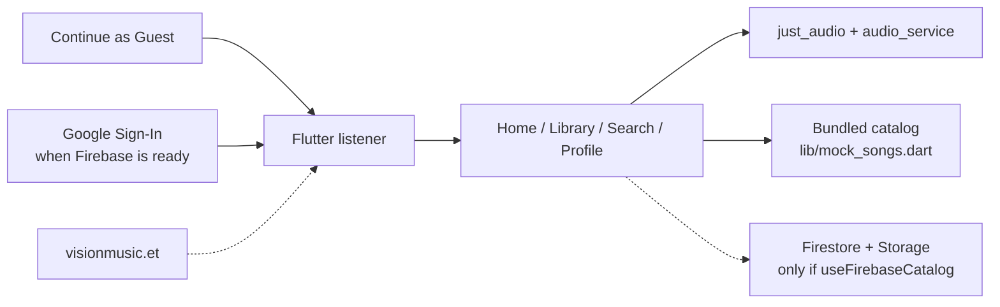

# Vision Music

> Open to remote AI automation roles. Email: [birragemedi@gmail.com](mailto:birragemedi@gmail.com) | GitHub: [@Birra3324](https://github.com/Birra3324) | LinkedIn: [birra-gemedi](https://www.linkedin.com/in/birra-gemedi-813337199/)

Cross-platform listener for Vision Entertainment. One Flutter codebase targets iOS, Android, macOS, and Web. Listeners browse Oromo music, play tracks with a persistent mini-player, save favorites on the device, and search the bundled catalog.

Live site: [www.visionmusic.et](https://www.visionmusic.et)

**How to demo:** [10–15 minute walkthrough](docs/demo.md) — clone, `flutter run` or Chrome, Continue as Guest, play a track, open Library, search. Screenshots: [docs/screenshots](docs/screenshots/README.md).

**Status (Days 26–27):** [public-docs checklist](docs/status.md).

This repository is the listener client. Catalog publishing, transcoding, and the admin studio stay in private projects and are not documented here.

## What it does

- Audio playback with background controls, a persistent mini-player, playlists, favorites, and search
- Guest mode, plus Google Sign-In when Firebase is ready
- Home, Library, Search, and Profile (a Watch tab is also in the shell)
- Bundled 8-track catalog so the app runs without a Firebase login
- Optional Firestore catalog behind `AppConfig.useFirebaseCatalog` (off in this tree)
- Localization: English, Afaan Oromo, Amharic, Arabic, French, and Spanish

Android application id: `com.visionmusic.app`. A public store listing is not part of this repo. The marketing site is the public URL.

## Stack

| Layer | Tech |
| --- | --- |
| Client | Flutter / Dart (`just_audio`, `audio_service`, Provider) |
| Auth | Firebase Auth, Google Sign-In; guest entry needs neither |
| Data | Bundled assets by default; Cloud Firestore and Firebase Storage when the catalog flag is on |
| Platforms | iOS, Android, macOS, Web |

Client config in `lib/firebase_options.dart`, `android/app/google-services.json`, and `GoogleService-Info.plist` is standard FlutterFire public client config. Those keys are restricted client identifiers. Signing keystores and service-account JSON stay out of git.

## Architecture

The diagram is the listener only. Admin publishing and backend jobs are outside this repository.



`AppConfig.useFirebaseCatalog` is `false`, so a local run uses the tracks in `assets/audio/`. Favorites and recent plays are stored on the device with `shared_preferences`.

## Run locally

Flutter stable with Dart 3.10 or newer (`environment.sdk` in `pubspec.yaml`).

```bash
git clone https://github.com/Birra3324/visionmusicapp.git
cd visionmusicapp
flutter pub get
flutter run -d chrome
```

`flutter devices` lists phones, simulators, and desktop targets. `flutter run` with no `-d` picks one. On the login screen, choose **Continue as Guest**. The timed path is [docs/demo.md](docs/demo.md).

## Repo layout

```
lib/
  main.dart
  app/main_shell.dart     # Home, Watch, Library, Search, Profile
  features/               # auth, library, search, profile
  audio/                  # background playback handler
  core/services/          # catalog flag, Firebase bootstrap
  mock_songs.dart         # bundled demo catalog
assets/audio/             # tracks used by the local catalog
docs/demo.md              # recruiter walkthrough
docs/status.md            # Days 26–27 checklist
docs/screenshots/         # how to capture UI shots
docs/internal/            # historical notes, not a public runbook
android/ ios/ macos/ web/
```

Analytics event names for the listener are in [docs/ANALYTICS_EVENT_SPEC.md](docs/ANALYTICS_EVENT_SPEC.md). Payloads use opaque track ids.

## Related public work

| Repo | What it is |
| --- | --- |
| [visionmusic-site](https://github.com/Birra3324/visionmusic-site) | Marketing site and privacy policy for [visionmusic.et](https://www.visionmusic.et) |
| [ai-intake-demo](https://github.com/Birra3324/ai-intake-demo) | FastAPI intake validation, optional LLM, n8n routing |
| [company-rag-assistant](https://github.com/Birra3324/company-rag-assistant) | Local knowledge assistant with hybrid retrieval |
| [customer-operations-agent](https://github.com/Birra3324/customer-operations-agent) | Ticket triage agent, handoff page, n8n bridge |

## Private boundary

This tree is the public listener. Publishing, transcoding, admin roles, and service accounts are out of scope. Historical handoff prompts, audits, and setup notes are kept in [docs/internal](docs/internal/README.md) so the technical record stays available. They are not an operations guide, and they do not include credentials.

## License

Private media catalog and artwork belong to Vision Entertainment. Code in this repository is for portfolio review. Do not redistribute tracks or artwork.
