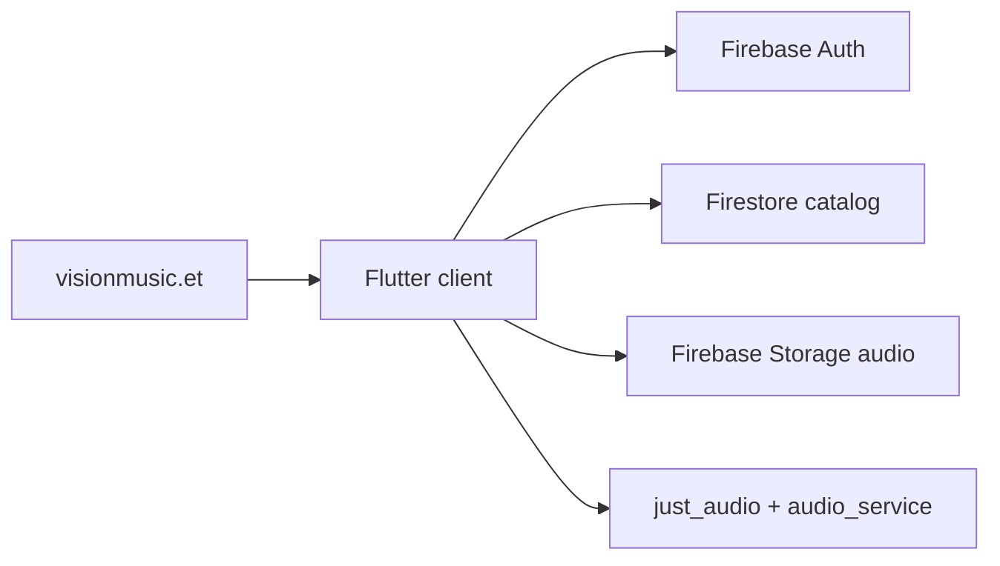

# Vision Music

Cross-platform music app for Vision Entertainment. One Flutter codebase targets iOS, Android, macOS, and Web.

Live site: [visionmusic.et](https://www.visionmusic.et)

This is the listener client. The private admin studio and Cloud Functions backend live in separate repos and stay private.

## What it does

- Audio playback with background controls, a persistent mini-player, playlists, favorites, and search
- Guest mode plus Google Sign-In (Firebase Auth)
- Home / Library / Search / Profile
- Firebase Auth, Firestore, Storage, Analytics, Crashlytics, App Check
- Localization (English and more via `l10n`)

## Stack

| Layer | Tech |
| --- | --- |
| Client | Flutter / Dart (`just_audio`, `audio_service`, Provider) |
| Auth | Firebase Auth, Google Sign-In |
| Data | Cloud Firestore, Firebase Storage |
| Platforms | iOS, Android (`com.visionmusic.app`), macOS, Web |

Related public artifacts:

- Marketing site: [github.com/Birra3324/visionmusic-site](https://github.com/Birra3324/visionmusic-site)
- AI intake automation (separate portfolio project): [github.com/Birra3324/ai-intake-demo](https://github.com/Birra3324/ai-intake-demo)

## Architecture



## Run locally

```bash
flutter pub get
flutter run
```

Firebase options are in `lib/firebase_options.dart` for the `visionmusic-dev` project. Client API keys in `google-services.json` / `GoogleService-Info.plist` are standard FlutterFire public client keys, restricted by app ID. Signing keystores are gitignored.

## Repo layout

```
lib/
  main.dart
  features/          # home, library, search, profile
  audio/             # playback + background handler
  services/
android/ ios/ macos/ web/
```

## Status

Active listener MVP. Catalog can run from a local demo set or Firebase. Video was cut from MVP. Backend admin publishing is a separate private project.

## License

Private media catalog and artwork belong to Vision Entertainment. Code in this repository is for portfolio review. Do not redistribute tracks or artwork.
